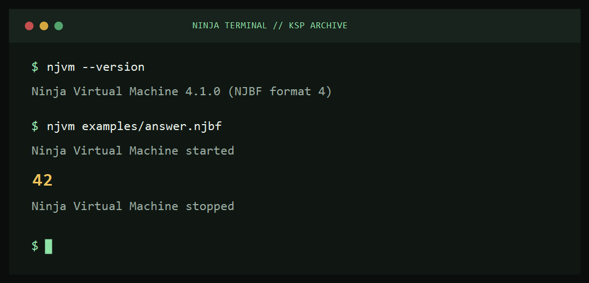

# Ninja Virtual Machine · Part One

[](https://github.com/sofoste93/NinjaVM-PartOne2020/actions/workflows/ci.yml)
[](https://en.cppreference.com/w/c/11)
[](#the-njbf-file)

**Ninja is not Java.** This repository preserves the first Ninja Virtual
Machine project created for the KSP course at THM in Gießen during 2020/2021.
It is a compact C implementation of a 32-bit stack machine and an archive of
the Ninja and assembly exercises that accompanied it.



## Download

The [latest release](https://github.com/sofoste93/NinjaVM-PartOne2020/releases/latest)
contains native packages for:

- Windows x64;
- Linux x64;
- macOS Intel;
- macOS Apple Silicon.

Extract the archive, open a terminal in that folder, then run:

```text
njvm --version
njvm path/to/program.njbf
```

On Windows, use `njvm.exe`. The small `examples/answer.njbf` program is ready
to run and prints `42`; no Ninja compiler is needed for this first test.

## Commands

```text
Usage: njvm [options] <code-file>

Options:
  --debug      start in the interactive step debugger
  --version    show version information and exit
  --help       show this help and exit
```

Inside the debugger, press **Enter** or `s` to execute one instruction, `p` to
print the stack, `c` to continue normally, and `q` to stop.

## Build from source

Requirements: a C11 compiler, CMake 3.16 or newer, and Python 3 for the
integration checks.

```bash
cmake -S . -B build -DCMAKE_BUILD_TYPE=Release
cmake --build build --config Release
ctest --test-dir build -C Release --output-on-failure
```

Visual Studio 2022 users can also run `scripts\build-msvc.bat` from a Developer
Command Prompt. The executable is written to `build\njvm.exe`.

## How the VM works

Each instruction is one 32-bit word. The highest byte contains the opcode and
the lower 24 bits contain an immediate value. `pushc 40`, for example, places
`40` on the operand stack. Arithmetic instructions remove their operands and
push the result back onto that stack.

The implementation is intentionally split into small learner-friendly parts:

- `src/main.c` parses the command line;
- `src/vm.c` loads and executes the program;
- `include/opcodes.h` documents the 32 opcodes and instruction encoding;
- `tests/test_cli.py` creates tiny binaries and verifies success and failure paths;
- `examples/` keeps the original KSP source exercises together.

### Instruction groups

| Group | Instructions |
| --- | --- |
| Stack and arithmetic | `pushc`, `add`, `sub`, `mul`, `div`, `mod`, `drop`, `dup` |
| Input and output | `rdint`, `wrint`, `rdchr`, `wrchr` |
| Variables and frames | `pushg`, `popg`, `asf`, `rsf`, `pushl`, `popl` |
| Comparisons | `eq`, `ne`, `lt`, `le`, `gt`, `ge` |
| Control flow | `jmp`, `brf`, `brt`, `call`, `ret`, `halt` |
| Return register | `pushr`, `popr` |

### The NJBF file

The loader accepts the original little-endian NJBF version 4 layout:

```text
4 bytes   magic: "NJBF"
4 bytes   format version: 4
4 bytes   instruction count
4 bytes   global variable count
N × 4     encoded instructions
```

Malformed files, invalid stack access, illegal opcodes, bad jumps and division
by zero now stop with an explanatory error and a non-zero process code.

## Project history

Version 4.1.0 preserves the original VM format while replacing the recursive
execution loop, fixing unsafe file parsing and completing the debugger. The old
CLion cache and compiled binaries were removed from version control.

Original contributors:

- Steph Claude Kouame M.
- Steph Sob Fouodji
- Robert Yvon Yonke
